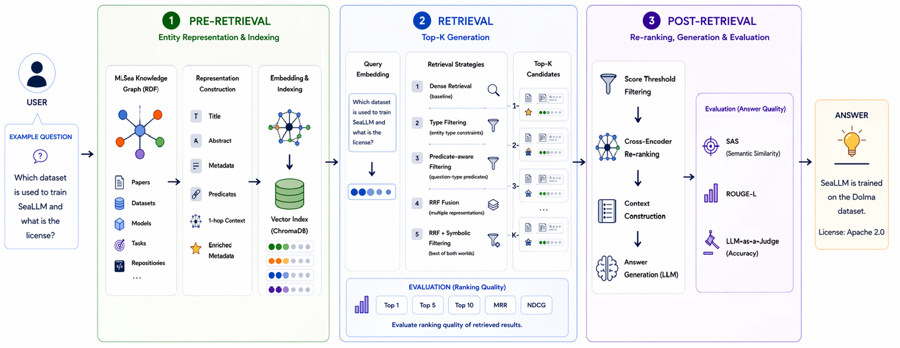

<h1 align="center">MLSea KG-RAG Retrieval Pipeline</h1>

<p align="center">
  A master thesis project on retrieval-augmented question answering over the MLSea knowledge graph.
</p>

<p align="center">
  <a href="#overview">Overview</a> ·
  <a href="#pipeline">Pipeline</a> ·
  <a href="#quick-start">Quick Start</a> ·
  <a href="#repository-structure">Structure</a> ·
  <a href="#retrieval-methods">Retrieval Methods</a> ·
  <a href="#authors">Authors</a>
</p>

<p align="center">
  
  
  
  
  
</p>

---

## Overview

This repository contains the implementation of a **Knowledge Graph Retrieval-Augmented Generation pipeline** developed for a master thesis on machine-learning question answering.

The project uses the [MLSea](https://mlsea.eu) knowledge graph as its main data source. It processes local RDF data, constructs entity-centric representations for papers, datasets, and models, indexes them in ChromaDB, and evaluates multiple retrieval strategies for finding relevant MLSea entities from natural-language questions.

The retrieved candidates are exported in a structured format for downstream post-retrieval processing, including reranking, context construction, answer generation, and evaluation.

> This repository is not the official MLSea resource repository. The official MLSea-KG resource code is available at [dtai-kg/MLSea-KGC](https://github.com/dtai-kg/MLSea-KGC).

---

## Pipeline

<p align="center">
  
</p>

The pipeline follows three main stages:

1. **Pre-retrieval**
   Local MLSea RDF data is parsed and transformed into entity-centric textual representations for papers, datasets, and models. These representations are embedded and indexed in ChromaDB.

2. **Retrieval**
   Natural-language questions are embedded and matched against the indexed representations using dense retrieval, hybrid filtering, and reciprocal-rank-fusion-based methods.

3. **Post-retrieval**
   Retrieved candidates are filtered, reranked, converted into context, and prepared for downstream answer generation and evaluation.

---

## Repository Structure

```text
config/                      # Pipeline configuration files

data/
  questions/                 # Question benchmark used for retrieval evaluation
  raw/                       # Local RDF dump files, not tracked in Git
  intermediate/              # Generated records, representations, and ChromaDB indexes
  results/                   # Generated evaluation outputs

scripts/                     # Utility scripts for figures, tables, and artifacts

src/
  pre_retrieval/             # Entity processing, representation construction, indexing
  retrieval/                 # Retrieval methods and evaluation pipeline
  post_retrieval/            # Adapters and post-retrieval processing utilities

figs/results_final/          # Final thesis figures and LaTeX snippets
assets/                      # README figures and project images
```

Large raw data files, ChromaDB indexes, intermediate representations, and generated experiment outputs are intentionally not tracked in Git.

---

## Quick Start

### 1. Create a virtual environment

```bash
python -m venv .venv
```

Activate it:

```bash
# Windows
.venv\Scripts\activate

# macOS/Linux
source .venv/bin/activate
```

### 2. Install dependencies

```bash
pip install -r requirements.txt
```

### 3. Start ChromaDB

ChromaDB should be running before indexing or retrieval experiments:

```bash
chroma run --path data/intermediate/chroma
```

---

## Data Setup

The local MLSea/Papers-with-Code RDF dump is expected at:

```text
data/raw/pwc_1.nt
```

This file is not included in the repository because of its size.

The question benchmark is expected at:

```text
data/questions/ml_questions_dataset.json
```

This file should be tracked in Git so that the retrieval evaluation setup is visible and reproducible.

---

## Running the Pipeline

### 1. Build pre-retrieval representations

```bash
py -m src.pre_retrieval.papers.scripts.run_all_experiments
py -m src.pre_retrieval.datasets.scripts.run_evaluate_datasets --representation all
py -m src.pre_retrieval.models.scripts.run_evaluate_models --representation all
```

Generate pre-retrieval artifacts:

```bash
py scripts/build_pre_retrieval_result_artifacts.py
```

### 2. Run retrieval experiments

```bash
py -m src.retrieval.scripts.run_all_retrieval_experiments --force
```

Retrieval outputs are written under:

```text
data/results/retrieval/
```

### 3. Generate final figures

```bash
py scripts/generate_results_final_figures.py --force
```

Final figures and LaTeX snippets are written to:

```text
figs/results_final/
```

### 4. Prepare post-retrieval inputs

For a single retrieval method:

```bash
py -m src.post_retrieval.adapters.retrieval_adapter --method pure_semantic_dense
```

Generated post-retrieval input files are written under:

```text
data/results/post_retrieval/inputs/
```

---

## Retrieval Methods

| Method                             | Purpose                                         |
| ---------------------------------- | ----------------------------------------------- |
| `pure_semantic_dense`              | Dense semantic retrieval baseline               |
| `hybrid_type_filtering`            | Type-aware structural control                   |
| `hybrid_type_onehop_filtering`     | Dense retrieval with graph-neighbourhood signal |
| `hybrid_predicate_aware_filtering` | Predicate-aware reranking                       |
| `optional_rrf_fusion`              | Multi-representation reciprocal rank fusion     |
| `optional_rrf_symbolic`            | RRF fusion followed by symbolic reranking       |

---

## Outputs

| Output                  | Location                                |
| ----------------------- | --------------------------------------- |
| ChromaDB vector indexes | `data/intermediate/chroma/`             |
| Pre-retrieval results   | `data/results/pre_retrieval/`           |
| Retrieval results       | `data/results/retrieval/`               |
| Post-retrieval inputs   | `data/results/post_retrieval/inputs/`   |
| Final figures           | `figs/results_final/`                   |
| LaTeX snippets          | `figs/results_final/LATEX_SNIPPETS.tex` |

Generated outputs are excluded from Git by default unless they are small final artifacts needed for reporting.

---

## Reproducibility Notes

The full pipeline depends on the local MLSea RDF dump, the question benchmark, the representation scripts, the embedding configuration, and the ChromaDB collections.

If only retrieval logic changes, the vector indexes do not need to be rebuilt. If the entity representations or embedding setup change, the pre-retrieval stage should be regenerated before rerunning retrieval experiments.

---

## Thesis Context

This repository supports a master thesis on **retrieval-augmented generation over knowledge graphs for machine-learning question answering**.

The project focuses on how entities from the MLSea knowledge graph can be represented, indexed, retrieved, and prepared for downstream answer generation in a KG-RAG pipeline.

---

## Authors

This project was developed by:

* **Yigit Alp OZTORUN**
* **Esat CAGLAYAN**

as part of a master thesis project on retrieval-augmented generation over knowledge graphs for machine-learning question answering.

---

## Acknowledgements

This project uses the [MLSea](https://mlsea.eu) knowledge graph as its main data source.

Official MLSea-KG resource code: [dtai-kg/MLSea-KGC](https://github.com/dtai-kg/MLSea-KGC)

---
