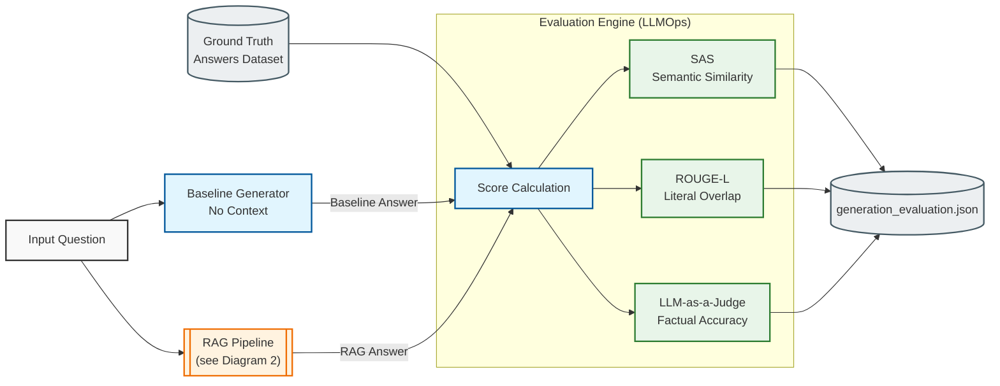
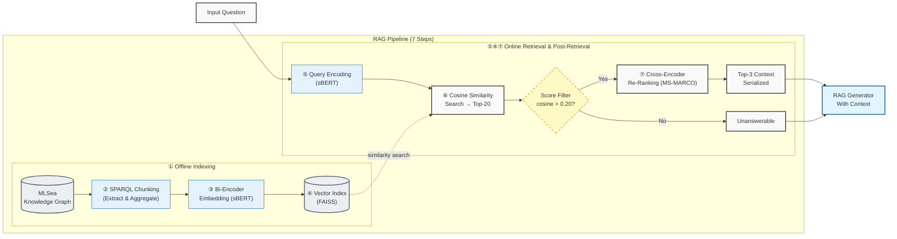
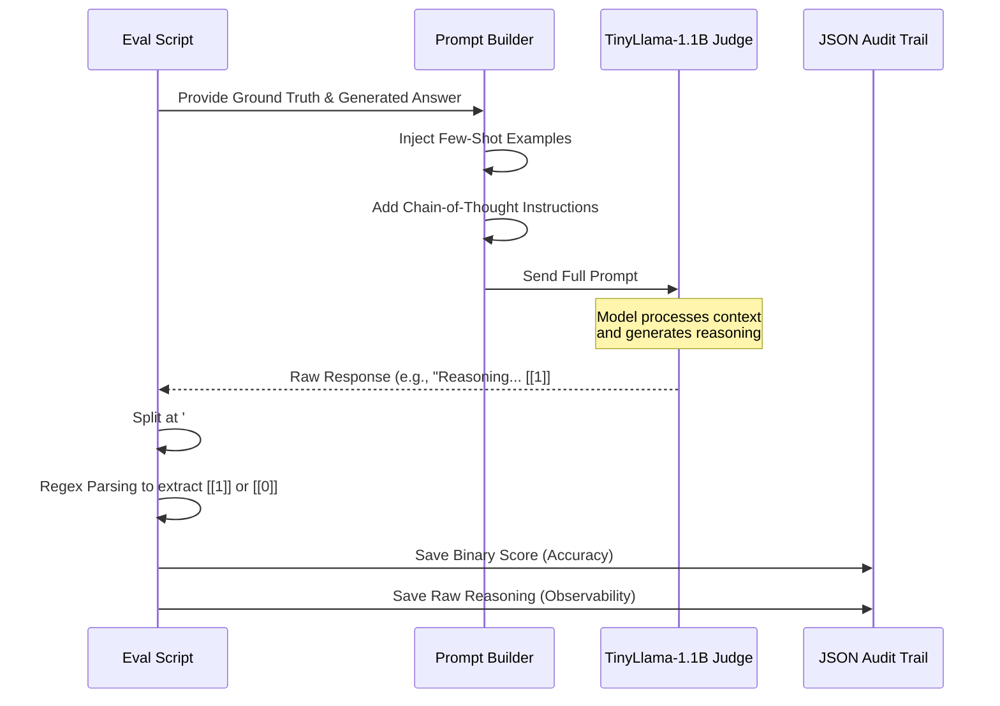
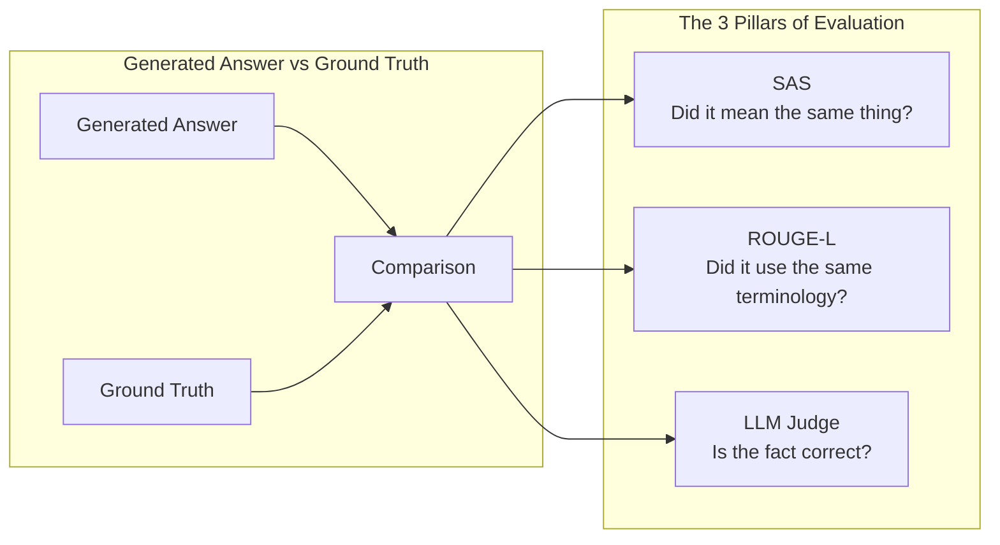

# RAG Pipeline Evaluation Visualizations

These Mermaid diagrams visually explain the evaluation framework. You can screenshot these or recreate them directly in Google Slides for your presentation.

## 1. Overall Evaluation Architecture (Baseline vs. RAG)

This diagram shows how we scientifically prove the value of the RAG system by comparing its output against a "Baseline" (no context) generation, and scoring both against the Ground Truth.

## 2. RAG Pipeline – Detailed 7-Step Architecture

This diagram breaks down the internal steps of the RAG Pipeline, from offline indexing of the MLSea Knowledge Graph all the way to the serialized context handed off to the LLM generator.

## 3. LLM-as-a-Judge Workflow & Audit Trail

This diagram illustrates the engineered flow for the LLM judge, specifically highlighting how we solved the "Instruction Drift" issue using Chain-of-Thought and robust parsing.

## 4. Metrics Breakdown

A simple flow showing exactly what each metric measures.

